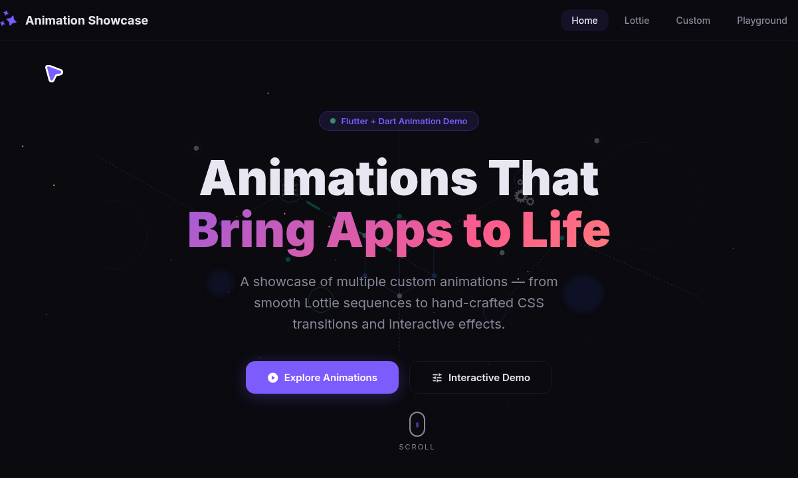
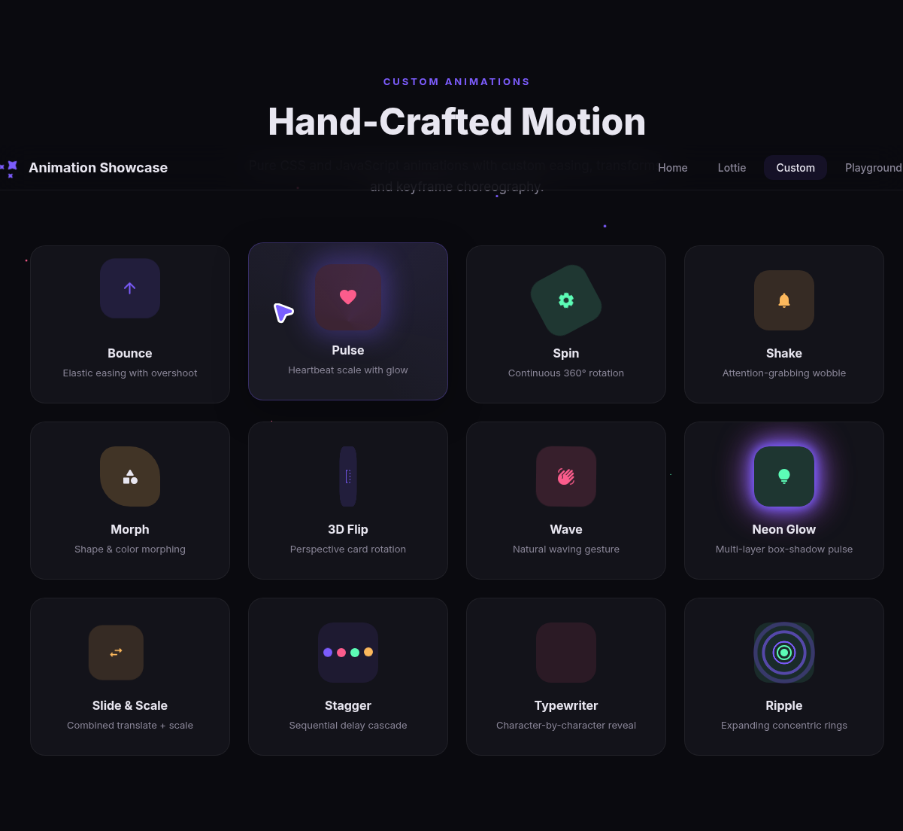
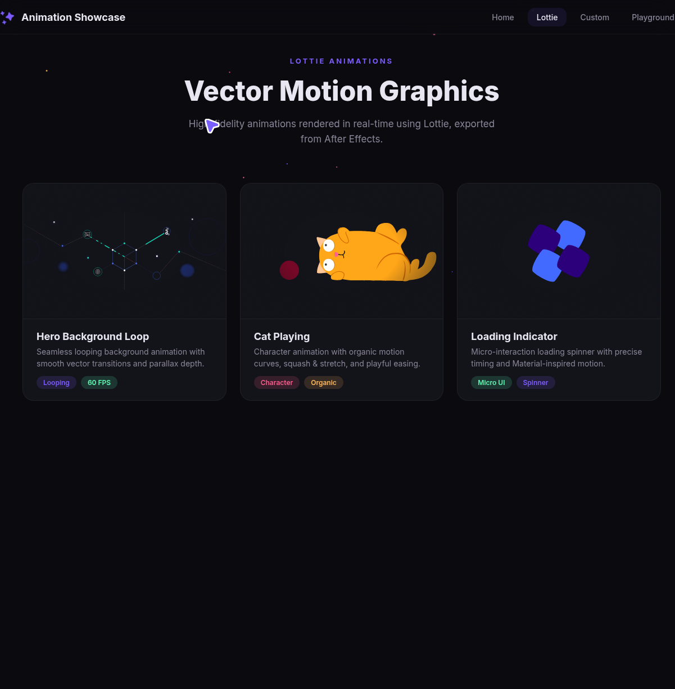
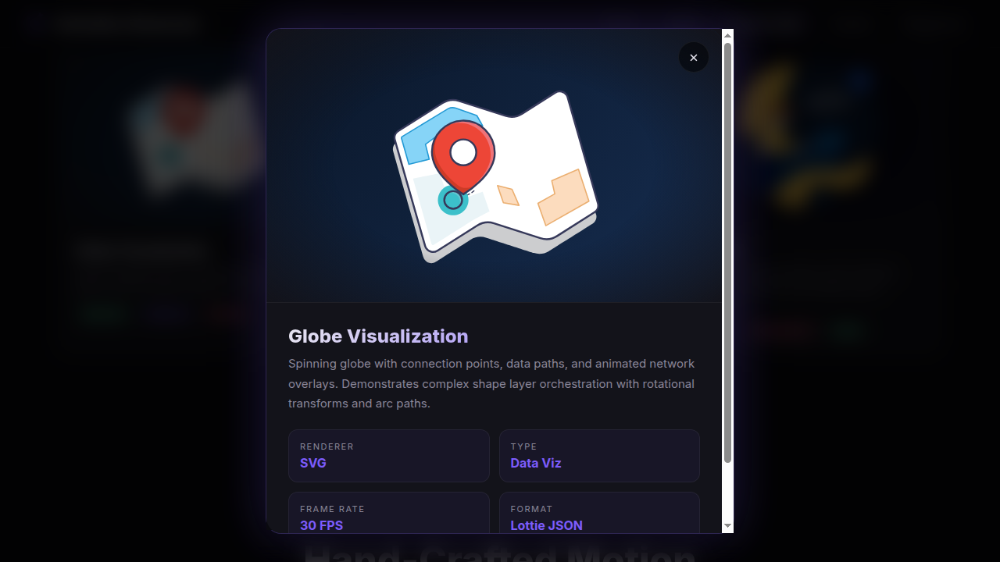
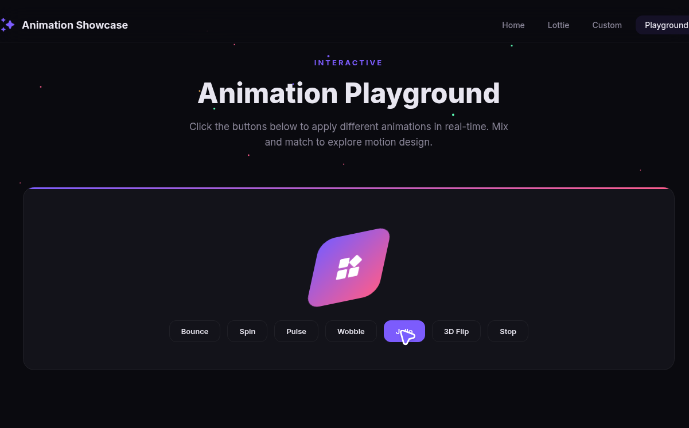

# Flutter Animation Showcase

A professional, high-performance **Flutter** application showcasing a variety of custom animations and **Lottie** integrations. This project demonstrates advanced **UI/UX** motion design techniques using **AnimationController**, **Transform**, and **Matrix4** in **Dart**.

## 🚀 Key Features

*   **Custom Motion Effects**: Unique animations including Bounce, Pulse, Spin, and Slide.
*   **Lottie Integration**: Seamlessly integrated high-quality vector animations for background and data visualization.
*   **Elastic Easing**: Realistic physics-based motion using `Curves.elasticOut`.
*   **Transformations**: Complex 3D and 2D transforms (Scale, Rotation, Translation).
*   **Performance Focused**: Optimized 60 FPS animations using `AnimatedBuilder`.

## 📸 Snapshots

Below are the visual representations of the different sections within the app:

| Hero Section | Custom Animations |
| :---: | :---: |
|  |  |

| Lottie Visuals | Data Analytics View |
| :---: | :---: |
|  |  |

| Globe Visualization | Jello Effects |
| :---: | :---: |
|  |  |

## 🛠️ Tech Stack

*   **Framework**: [Flutter](https://flutter.dev)
*   **Language**: [Dart](https://dart.dev)
*   **Libraries**: `lottie`, `cupertino_icons`

## ⚙️ Installation

1.  **Clone the repository:**
    ```bash
    git clone https://github.com/tayyab602/flutter-animation-showcase.git
    ```
2.  **Navigate to the project directory:**
    ```bash
    cd flutter-animation-showcase
    ```
3.  **Install dependencies:**
    ```bash
    flutter pub get
    ```
4.  **Run the app:**
    ```bash
    flutter run
    ```

## 📂 Project Structure

*   `lib/main.dart`: The core logic containing the animation controllers and UI layout.
*   `assets/`: Contains Lottie JSON files for enhanced visual storytelling.

---
Developed with ❤️ by [Tayyab](https://github.com/tayyab602)
